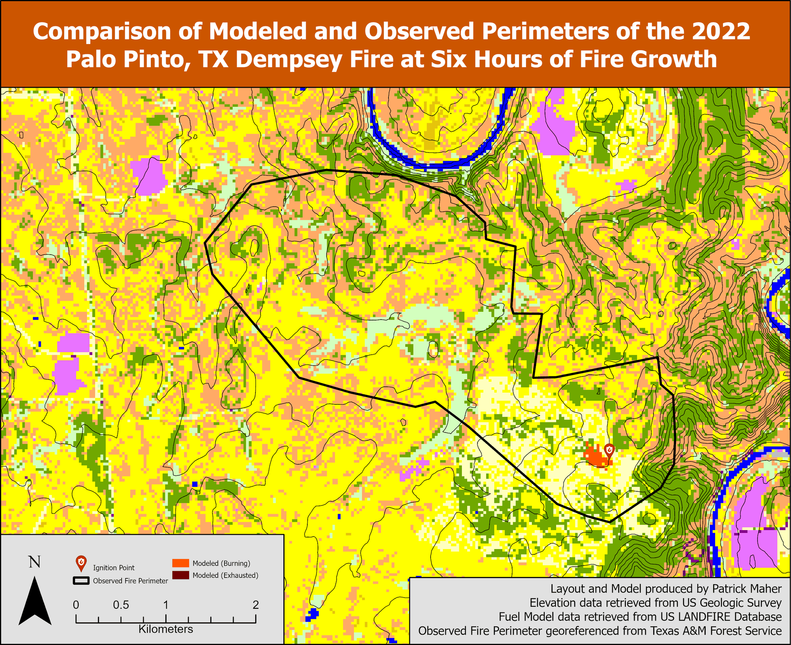

# GIS Portfolio

A visual portfolio showcasing my recent GIS work and spatial analysis projects.

---

## 1. Cellular Wildfire Simulation Model

I programmed a GIS-based wildfire simulation model in Python, packaged as a geoprocessing tool in ArcGIS Pro. This cellular automata model demonstrates fire spread dynamics across terrain. It's automated and can be used to model fire spread anywhere in the United States.

**More details:** [View the cellular fire modeling project on GitHub](https://github.com/Patmah729/CellularFireModeling/tree/main)

---

## 2. Longhorn Council Property Vision Mapping

I briefly served as a contributor to the Longhorn Council Property Vision Committee in the summer of 2026, maintaining an online spatial database and interactive map used for communicating and planning potential property improvements at Worth Ranch. The platform integrates multiple layers including infrastructure, facilities, and proposed improvements.

**Explore the map:** [View the interactive mapping project](https://qgiscloud.com/pmaherWR/WRMappingOnline/?l=Point%20of%20Interest!%2CUpdatedRoads!%2CParkingLots!%2CBikeTrails!%2CBikePark!%2CProposal%20Labels!%2CValleyCabins!%2Csepticarea!%2CNew%20Bathrooms!%2CCanoelivery!%2CRail%20Stations!%2CRailroad%20Loop!%2CNew%20Alternate%20Aquatics%20Area!%2CPavilionAreas!%2CMcClureHomestead!%2CTrainingCenter!%2CMcClureFields!%2CRangesOutline!%2CRangeBuildings!%2CSuspensionBridge!%2CRifleRange!%2CShotgunRange!%2CArcheryRange!%2CTradesBuilding!%2CClimbingFacility!%2CRelocateBoatDocks!%2CWR%20Village!%2CProposedCampsites%5B50%5D!%2CAstronomy%20Center!%2CSplashpad!%2CGamesArea!%2CShadeTrees!%2CRiver%2CStreams%2CPool%2CBuildings%2CLatrines%2CBuilt%20Surface%2CFence%2CMinor%20Road%2CMajor%20Road%2CTrails%2CCampsiteLabels%2CCampsites%2C10ft%20Contours%2C5ft%20Contours!%2C2ft%20Contours!%2CWoodlands%2CSatellite!&t=WRMappingOnline&e=-10948653%2C3869255%2C-10940742%2C3872980)

---

## 3. Ross Fire Satellite Imagery Analysis

Post-fire analysis and visualization of satellite imagery capturing the impact and footprint of the August-September 2026 Ross Fire.

 
